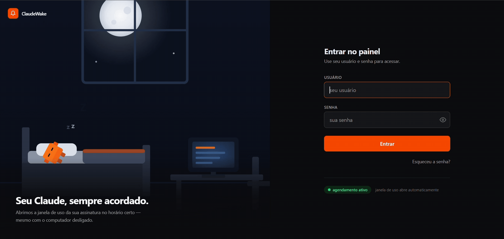
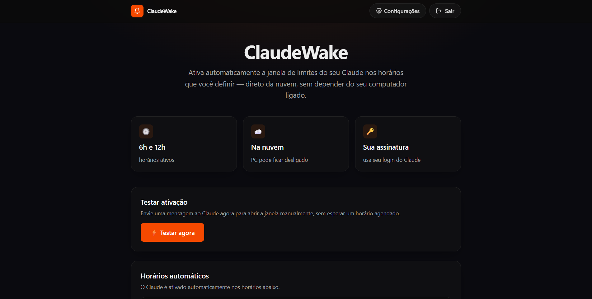
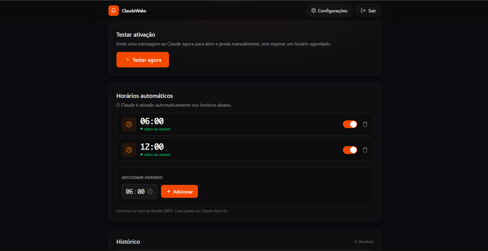
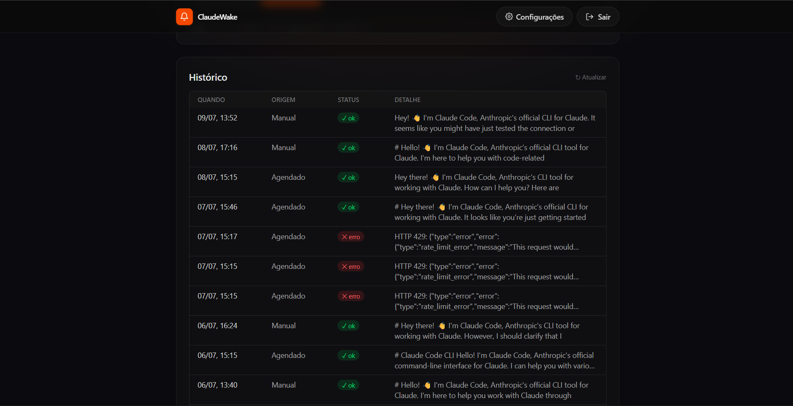

# 🔔 ClaudeWake

**Open your Claude usage window automatically, at the times you choose — straight from the cloud, even with your computer turned off.**

ClaudeWake is a tiny self-hosted web app that sends a scheduled message to Claude on your behalf, so your usage window is already open when you sit down to work. You set the times, it runs in the cloud (Vercel + Upstash), and it stays out of your way.

> **Single-user by design.** Each person runs their own instance with their own Claude token. Nothing is shared, and no one else's credentials ever touch your deployment.

<p align="center">
  
</p>

<p align="center">
  
</p>

<p align="center">
  
  
</p>

---

## ✨ Features

- ⏰ **Scheduled activation** — pick the times (e.g. 6h and 14h); a cloud cron opens the window for you.
- ☁️ **Runs in the cloud** — your PC can be off. Powered by Vercel + Upstash QStash.
- 🔐 **Your token, encrypted** — your Claude token is stored encrypted (AES-256-GCM) and never leaves your instance.
- ⚡ **Test now** — trigger an activation manually to check everything works.
- 🗒️ **History** — see every run (manual or scheduled) and Claude's reply.
- 🔒 **Password-protected panel** — a simple login guards your dashboard and token.

## 🧰 Tech stack

Next.js 15 · React 19 · TypeScript · Tailwind CSS v4 · Upstash Redis · Upstash QStash · Vercel

---

## 🚀 Deploy your own (the easy way)

You need free accounts on **Vercel** and **Upstash**. The whole thing runs on free tiers.

### Option A — Let Claude do it for you 🤖

Open this repo in **Claude Code** (or paste the prompt below into Claude) and let it walk you through the whole setup — it reads [`CLAUDE.md`](CLAUDE.md) and guides you step by step, only asking for the few things that require your login:

```
Clone https://github.com/Dev-JacksonFelipe/ClaudeWake and help me deploy my own
instance. Read CLAUDE.md, then walk me through creating the Upstash Redis + QStash
resources, generating the secrets, setting the environment variables on Vercel, and
deploying. Ask me only for the values that require my own login.
```

### Option B — One-click deploy

[](https://vercel.com/new/clone?repository-url=https%3A%2F%2Fgithub.com%2FDev-JacksonFelipe%2FClaudeWake&env=APP_USERNAME,APP_PASSWORD,SESSION_SECRET,TOKEN_ENCRYPTION_KEY,UPSTASH_REDIS_REST_URL,UPSTASH_REDIS_REST_TOKEN,QSTASH_TOKEN,QSTASH_CURRENT_SIGNING_KEY,QSTASH_NEXT_SIGNING_KEY&envDescription=Auth%2C%20secrets%2C%20Upstash%20Redis%20and%20QStash%20credentials&envLink=https%3A%2F%2Fgithub.com%2FDev-JacksonFelipe%2FClaudeWake%23-environment-variables)

You'll still need to create the Upstash Redis and QStash resources first (see below) so you have their credentials to paste in.

---

## 🔧 Manual setup

### 1. Create the storage (Upstash)

1. Sign up at [upstash.com](https://upstash.com) (free).
2. **Redis** → create a database → from the **REST API** section copy `UPSTASH_REDIS_REST_URL` and `UPSTASH_REDIS_REST_TOKEN`.
3. **QStash** → copy `QSTASH_TOKEN`, `QSTASH_CURRENT_SIGNING_KEY` and `QSTASH_NEXT_SIGNING_KEY`.

### 2. Generate the secrets

```bash
# SESSION_SECRET
node -e "console.log(require('crypto').randomBytes(32).toString('hex'))"
# TOKEN_ENCRYPTION_KEY (use a different value!)
node -e "console.log(require('crypto').randomBytes(32).toString('hex'))"
```

### 3. Deploy to Vercel

Import the repo on [Vercel](https://vercel.com/new) and set the environment variables below.

### 4. Add your Claude token

Generate a token in your terminal (requires the Claude CLI and your login):

```bash
claude setup-token
```

Then open your deployed app → **Settings** → paste the token. It's encrypted before being saved.

### 5. Set your schedule

On the dashboard, add the times you want the usage window opened. Done.

---

## 🔑 Environment variables

| Variable | Required | Description |
|---|:---:|---|
| `APP_USERNAME` | ✅ | Username for the panel login. |
| `APP_PASSWORD` | ✅ | Password for the panel login. Choose a strong one. |
| `SESSION_SECRET` | ✅ | Random 64-char hex — signs the session cookie. |
| `TOKEN_ENCRYPTION_KEY` | ✅ | Random 64-char hex (different from above) — encrypts your Claude token. |
| `UPSTASH_REDIS_REST_URL` | ✅ | From Upstash Redis → REST API. |
| `UPSTASH_REDIS_REST_TOKEN` | ✅ | From Upstash Redis → REST API. |
| `QSTASH_TOKEN` | ✅ | From Upstash QStash. |
| `QSTASH_CURRENT_SIGNING_KEY` | ✅ | From Upstash QStash. |
| `QSTASH_NEXT_SIGNING_KEY` | ✅ | From Upstash QStash. |
| `QSTASH_URL` | ⬜ | Only if you use a non-default QStash region. |
| `APP_URL` | ⬜ | Public URL of your app. Auto-detected in production; set it only if needed. |

See [`.env.example`](.env.example) for a copy-paste template.

---

## 🖥️ Run locally

```bash
git clone https://github.com/Dev-JacksonFelipe/ClaudeWake.git
cd ClaudeWake
npm install
cp .env.example .env.local   # then fill in the values
npm run dev
```

Open http://localhost:3000.

---

## ⚠️ Disclaimer

This project automates sending a message to Claude with **your own** account token on a schedule. You are responsible for using it in accordance with [Anthropic's Terms of Service and Usage Policies](https://www.anthropic.com/legal). It is provided "as is", without warranty of any kind (see [LICENSE](LICENSE)). Never deploy an instance that stores anyone's token but your own.

## 📄 License

[MIT](LICENSE) © Jackson Felipe
